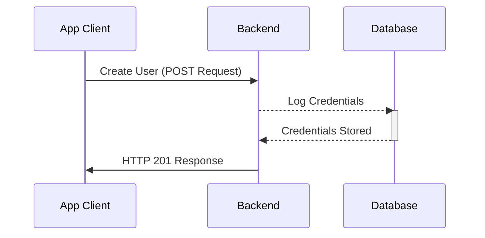
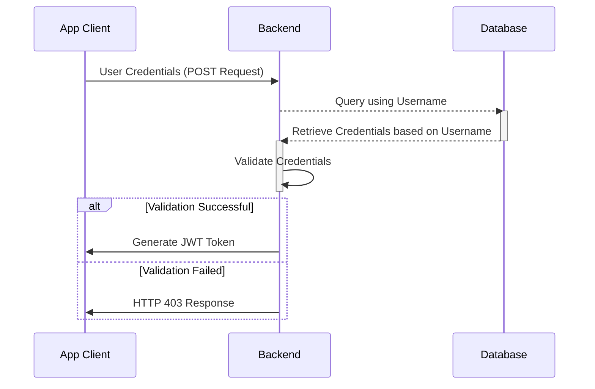
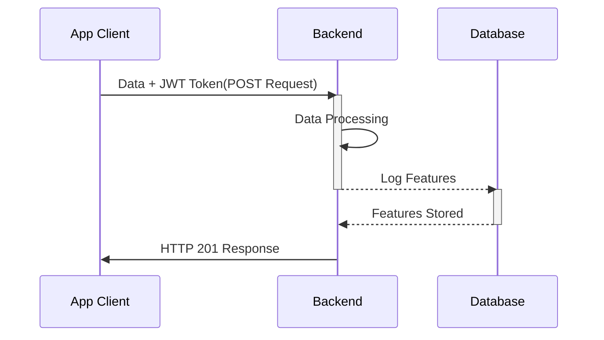
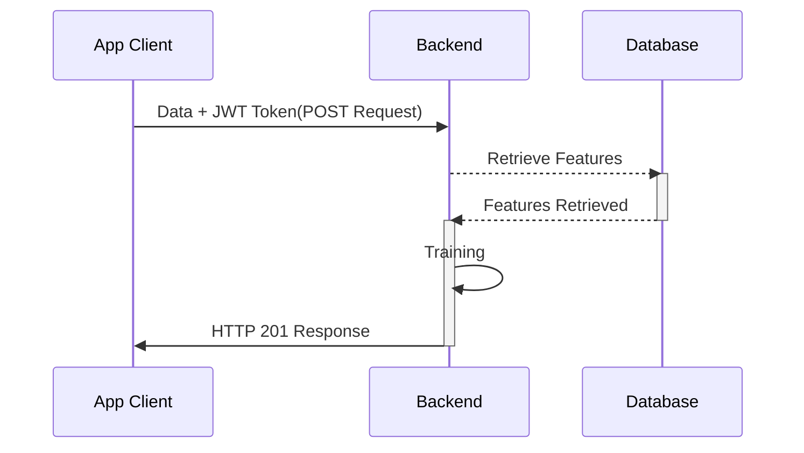
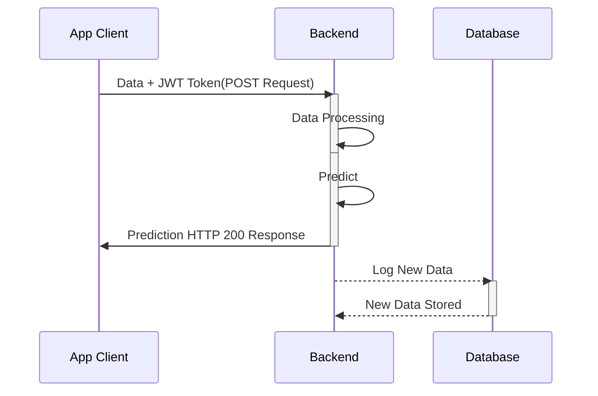
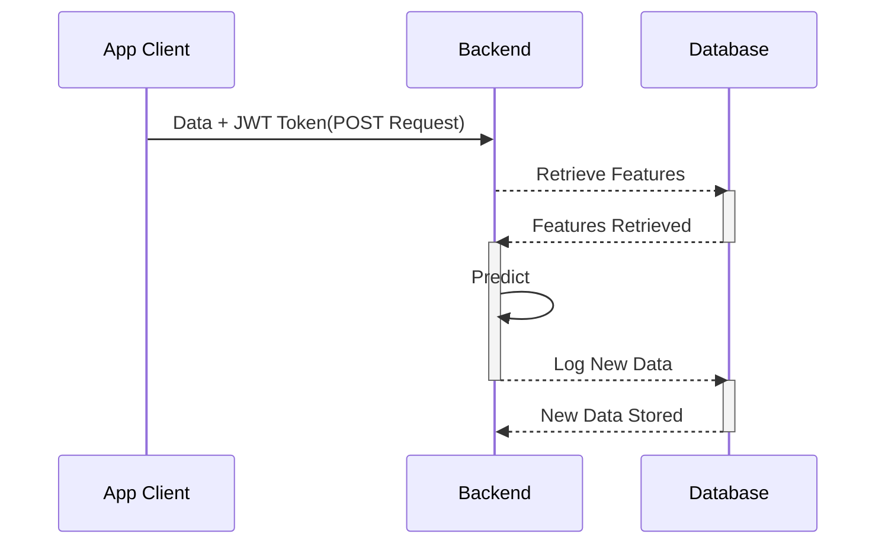

# microservices-fastapi
Building a full fledged  Microservices using FastAPI

### User Registration

### User Login

### Data Processing
#### Without using Celery/RabbitMQ

### ML Training
#### Without using Celery/RabbitMQ

### ML Realtime Inference

### ML Batch Inference
#### Without using Celery/RabbitMQ

